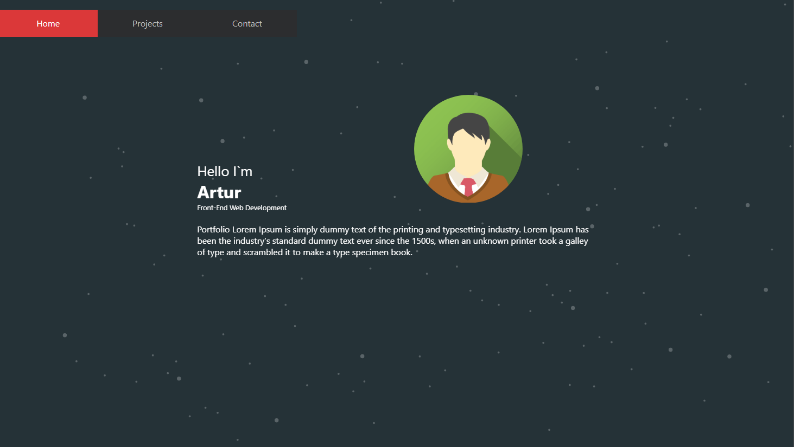

# Modern react Portfolio

## Desciption

Creating a portfolio using React will help set you apart from other developers whose portfolios do not use some of the latest technologies

## Installation

In the project directory, you can run:

### `npm start`

Runs the app in the development mode.\

### `npm test`

Launches the test runner in the interactive watch mode.\

### `npm run build`

Builds the app for production to the `build` folder.\
It correctly bundles React in production mode and optimizes the build for the best performance.

## Usage

* link to [@react-spring/parallax](https://www.react-spring.dev/docs/components/parallax).
* link to [react-router-dom](https://reactrouter.com/en/main).

## Contributing
    Even if you like to write code, other types of contributions are a great way to get involved with a project and meet other community members. Building those relationships will give you opportunities to work on other parts of the project.

## Mock-Up

The following image shows the web application's appearance and functionality:

## Questions
    
* The URL of the GitHub repository. [Repository link](https://github.com/vaselisk999/modern_react_portfolio).

* The URL of the deployed application. [Application link](https://vaselisk999.github.io/modern_react_portfolio/).